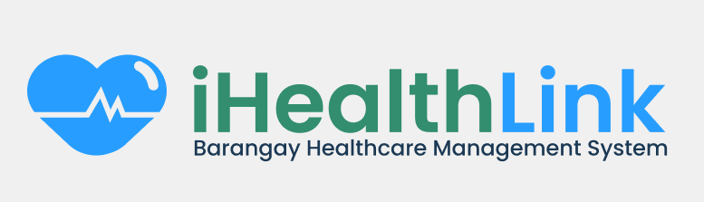

# 🎓 

<h1 align="center">
  
</h1>

  A Laravel-based <strong>Barangay Healthcare Management System</strong> that allows barangay health workers and administrators to manage patients, health services, activities, and medical records efficiently.

---

## 🚀 Features  
✅ User Authentication via Jetstream  
✅ Health Service & Patient Management  
✅ Messaging and Activity Tracking  
✅ Livewire + Alpine.js for Reactive UI  
✅ Tailwind CSS for a Beautiful Interface  
✅ Modern Frontend Build via Vite  
✅ Organized Migrations for Setup  

---

## 🛠 Installation Guide  

Follow these steps to set up the project:  

### 1️⃣ Clone the Repository  

## Gibo nganay database sa phpmyadmin  
    create database mygrades

## 🛠 Installation Guide  

Follow these steps to set up the project:  

### 1️⃣ Clone the Repository  

    git clone https://github.com/ybunnn-dev/ihealthlink.git

### then open the folder in vscode with this command:  
    cd ihealthlink

#### 2. Install PHP Dependencies: Use Composer to install the required PHP dependencies for Laravel  

    composer install

#### 3. Install JavaScript Dependencies: Install the required frontend packages  

    npm install

#### 4. Set Up Environment Variables: Create a .env file by copying the example  

    cp .env.example .env

#### 5. Open the .env file and update the following variables to match your local environment  

    DB_CONNECTION=mysql
    DB_HOST=127.0.0.1
    DB_PORT=3306
    DB_DATABASE=ihealthlink
    DB_USERNAME=root
    DB_PASSWORD=

### 6. Make sure your XAMPP server is running and the database `ihealthlink` exists in phpMyAdmin  

#### 7. Run the Artisan Key Generate Command  

    php artisan key:generate

### 8. Run the Artisan Migrate Command to create the tables  

    php artisan migrate

### 9. Build frontend assets using Vite  

    npm run dev

#### 10. Run the Application  

    php artisan serve

The application will be available at http://localhost:8000
